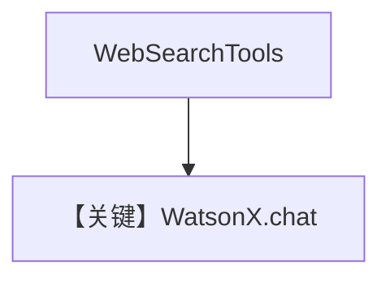

# tool_use.md — 实现原理分析

<!-- cookbook-py-source:start -->
## 完整源码

```python
"""Run `uv pip install ddgs` to install dependencies."""

import asyncio

from agno.agent import Agent
from agno.models.ibm import WatsonX
from agno.tools.websearch import WebSearchTools

# ---------------------------------------------------------------------------
# Create Agent
# ---------------------------------------------------------------------------

agent = Agent(
    model=WatsonX(id="mistralai/mistral-small-3-1-24b-instruct-2503"),
    tools=[WebSearchTools()],
    markdown=True,
)

# ---------------------------------------------------------------------------
# Run Agent
# ---------------------------------------------------------------------------
if __name__ == "__main__":
    # --- Sync + Streaming ---
    agent.print_response("Whats happening in France?", stream=True)

    # --- Async + Streaming ---
    asyncio.run(agent.aprint_response("Whats happening in France?", stream=True))
```

<!-- cookbook-py-source:end -->

> 源文件：`cookbook/90_models/ibm/watsonx/tool_use.py`

## 概述

**`WatsonX` + WebSearchTools**，同步流式与异步流式。

**核心配置一览：**

| 配置项 | 值 | 说明 |
|--------|-----|------|
| `model` | `WatsonX(id="mistralai/mistral-small-3-1-24b-instruct-2503")` | WatsonX |
| `tools` | `[WebSearchTools()]` | 搜索 |
| `markdown` | `True` | Markdown |

## System Prompt 组装

`<additional_information>` 含 Markdown 指引；工具 schema 由 Agent 注入。

用户消息：`Whats happening in France?`

## 完整 API 请求

`client.chat` + tools 参数（`get_request_params` 合并）。

## Mermaid 流程图



## 关键源码文件索引

| 文件 | 关键 |
|------|------|
| `agno/models/ibm/watsonx.py` | `invoke` L162+ |
