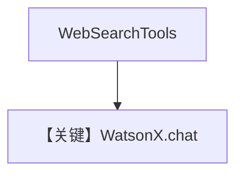

# tool_use.md — 实现原理分析

> 源文件：`cookbook/90_models/ibm/watsonx/tool_use.py`

## 概述

**`WatsonX` + WebSearchTools**，同步流式与异步流式。

**核心配置一览：**

| 配置项 | 值 | 说明 |
|--------|-----|------|
| `model` | `WatsonX(id="mistralai/mistral-small-3-1-24b-instruct-2503")` | WatsonX |
| `tools` | `[WebSearchTools()]` | 搜索 |
| `markdown` | `True` | Markdown |

## System Prompt 组装

`<additional_information>` 含 Markdown 指引；工具 schema 由 Agent 注入。

用户消息：`Whats happening in France?`

## 完整 API 请求

`client.chat` + tools 参数（`get_request_params` 合并）。

## Mermaid 流程图

## 关键源码文件索引

| 文件 | 关键 |
|------|------|
| `agno/models/ibm/watsonx.py` | `invoke` L162+ |
