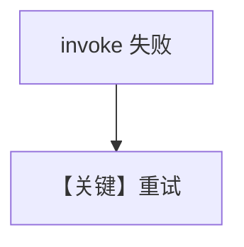

# retry.md — 实现原理分析

> 源文件：`cookbook/90_models/internlm/retry.py`

## 概述

**`InternLM` 错误 id + 重试参数**，与其它厂商 `retry.py` 模式一致。

**核心配置一览：**

| 配置项 | 值 | 说明 |
|--------|-----|------|
| `model` | `InternLM(id="internlm-wrong-id", retries=3, delay_between_retries=1, exponential_backoff=True)` | InternLM |

## 完整 API 请求

以 `InternLM` 适配器 `invoke` 为准（通常为 OpenAI 兼容或厂商 SDK）。

## Mermaid 流程图

## 关键源码文件索引

| 文件 | 关键 |
|------|------|
| `agno/models/internlm/` | `InternLM` 类 |
