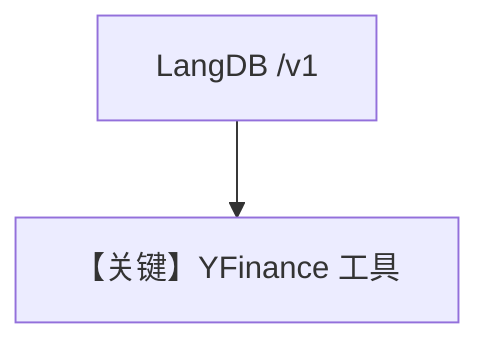

# agent.md — 实现原理分析

> 源文件：`cookbook/90_models/langdb/agent.py`

## 概述

**`LangDB(id="gpt-4o")` + YFinanceTools + instructions**，演示股价查询（同步/流式）。

**核心配置一览：**

| 配置项 | 值 | 说明 |
|--------|-----|------|
| `model` | `LangDB(id="gpt-4o")` | LangDB OpenAI 兼容端点 |
| `tools` | `[YFinanceTools()]` | 金融 |
| `instructions` | `["Use tables where possible."]` | 表格 |
| `markdown` | `True` | Markdown |

## 架构分层

`LangDB` 继承 **`OpenAILike`**（`langdb/langdb.py`），`base_url` 形如 `https://api.us-east-1.langdb.ai/{project_id}/v1`，使用 **Chat Completions** 形态。

## System Prompt 组装

### instructions 原样

```text
- Use tables where possible.
```

含 `<additional_information>` Markdown 段。

用户消息：`What is the stock price of NVDA and TSLA`

## 完整 API 请求

OpenAI 兼容：`client.chat.completions.create`（经 LangDB 路由），需 **`LANGDB_API_KEY`** 与 **`LANGDB_PROJECT_ID`**（见 `LangDB._get_client_params`）。

## Mermaid 流程图



## 关键源码文件索引

| 文件 | 关键 |
|------|------|
| `agno/models/langdb/langdb.py` | `LangDB`、`_get_client_params` |
| `agno/models/openai/like.py` | `OpenAILike` invoke |
