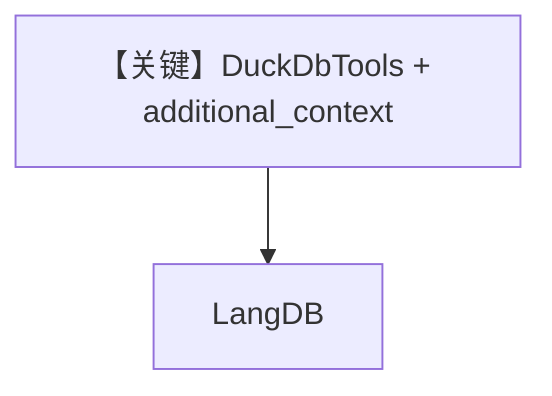

# data_analyst.md — 实现原理分析

> 源文件：`cookbook/90_models/langdb/data_analyst.py`

## 概述

**`DuckDbTools` 载入 CSV 建表 + `additional_context` 描述表结构 + LangDB**，用于 SQL 分析平均评分。

**核心配置一览：**

| 配置项 | 值 | 说明 |
|--------|-----|------|
| `model` | `LangDB(id="llama3-1-70b-instruct-v1.0")` | LangDB |
| `tools` | `[duckdb_tools]` | DuckDB |
| `markdown` | `True` | Markdown |
| `additional_context` | dedent 表说明 | 附加上下文 |

## System Prompt 组装

### additional_context 原样

```text
You have access to the following tables:
- movies: contains information about movies from IMDB.
```

（`_messages.py` 3.3.8 在 expected_output 之后附加。）

用户消息：`What is the average rating of movies?`

## 完整 API 请求

LangDB `completion` + tools；DuckDB 工具在本地执行 SQL。

## Mermaid 流程图



## 关键源码文件索引

| 文件 | 关键 |
|------|------|
| `agno/agent/_messages.py` | 3.3.8 `additional_context` |
| `agno/tools/duckdb.py` | DuckDbTools |
