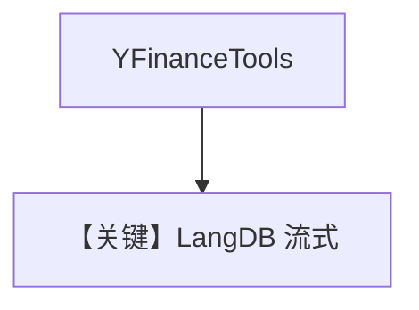

# finance_agent.md — 实现原理分析

<!-- cookbook-py-source:start -->
## 完整源码

```python
"""Run `uv pip install yfinance` to install dependencies."""

from agno.agent import Agent
from agno.models.langdb import LangDB
from agno.tools.yfinance import YFinanceTools

# ---------------------------------------------------------------------------
# Create Agent
# ---------------------------------------------------------------------------

agent = Agent(
    model=LangDB(id="llama3-1-70b-instruct-v1.0"),
    tools=[YFinanceTools()],
    description="You are an investment analyst that researches stocks and helps users make informed decisions.",
    instructions=["Use tables to display data where possible."],
    markdown=True,
)

# agent.print_response("Share the NVDA stock price and analyst recommendations", stream=True)
agent.print_response("Summarize fundamentals for TSLA", stream=True)

# ---------------------------------------------------------------------------
# Run Agent
# ---------------------------------------------------------------------------

if __name__ == "__main__":
    pass
```

<!-- cookbook-py-source:end -->

> 源文件：`cookbook/90_models/langdb/finance_agent.py`

## 概述

**LangDB + YFinance**，带 `description` 与表格指令，流式输出基本面摘要。

**核心配置一览：**

| 配置项 | 值 | 说明 |
|--------|-----|------|
| `model` | `LangDB(id="llama3-1-70b-instruct-v1.0")` | LangDB |
| `tools` | `[YFinanceTools()]` | 金融 |
| `description` | `You are an investment analyst that researches stocks and helps users make informed decisions.` | 角色 |
| `instructions` | `["Use tables to display data where possible."]` | 表格 |
| `markdown` | `True` | Markdown |

## System Prompt 组装

### 字面量

```text
You are an investment analyst that researches stocks and helps users make informed decisions.
```

```text
- Use tables to display data where possible.
```

用户消息：`Summarize fundamentals for TSLA`

## 完整 API 请求

OpenAI 兼容 Chat Completions 经 LangDB。

## Mermaid 流程图



## 关键源码文件索引

| 文件 | 关键 |
|------|------|
| `agno/models/langdb/langdb.py` | `LangDB` |
