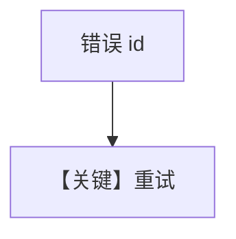

# retry.md — 实现原理分析

<!-- cookbook-py-source:start -->
## 完整源码

```python
"""Example demonstrating how to set up retries with LangDB."""

from agno.agent import Agent
from agno.models.langdb import LangDB

# ---------------------------------------------------------------------------
# Create Agent
# ---------------------------------------------------------------------------

# We will use a deliberately wrong model ID, to trigger retries.
wrong_model_id = "langdb-wrong-id"

agent = Agent(
    model=LangDB(
        id=wrong_model_id,
        retries=3,  # Number of times to retry the request.
        delay_between_retries=1,  # Delay between retries in seconds.
        exponential_backoff=True,  # If True, the delay between retries is doubled each time.
    ),
)

agent.print_response("What is the capital of France?")

# ---------------------------------------------------------------------------
# Run Agent
# ---------------------------------------------------------------------------

if __name__ == "__main__":
    pass
```

<!-- cookbook-py-source:end -->

> 源文件：`cookbook/90_models/langdb/retry.py`

## 概述

**`LangDB` 错误 id + 重试**，与其它 `retry.py` 一致。

**核心配置一览：**

| 配置项 | 值 | 说明 |
|--------|-----|------|
| `model` | `LangDB(id="langdb-wrong-id", retries=3, delay_between_retries=1, exponential_backoff=True)` | LangDB |

## 完整 API 请求

`OpenAILike` 路径上的 `chat.completions` 失败并重试。

## Mermaid 流程图



## 关键源码文件索引

| 文件 | 关键 |
|------|------|
| `agno/models/langdb/langdb.py` | 认证与 base_url |
