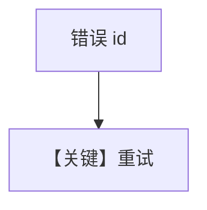

# retry.md — 实现原理分析

> 源文件：`cookbook/90_models/langdb/retry.py`

## 概述

**`LangDB` 错误 id + 重试**，与其它 `retry.py` 一致。

**核心配置一览：**

| 配置项 | 值 | 说明 |
|--------|-----|------|
| `model` | `LangDB(id="langdb-wrong-id", retries=3, delay_between_retries=1, exponential_backoff=True)` | LangDB |

## 完整 API 请求

`OpenAILike` 路径上的 `chat.completions` 失败并重试。

## Mermaid 流程图

## 关键源码文件索引

| 文件 | 关键 |
|------|------|
| `agno/models/langdb/langdb.py` | 认证与 base_url |
