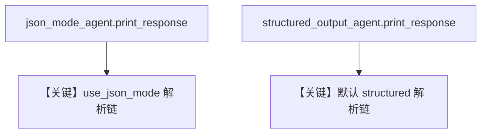

# structured_output.md — 实现原理分析

<!-- cookbook-py-source:start -->
## 完整源码

```python
"""
Langdb Structured Output
========================

Cookbook example for `langdb/structured_output.py`.
"""

from typing import List

from agno.agent import Agent, RunOutput  # noqa
from agno.models.langdb import LangDB
from pydantic import BaseModel, Field
from rich.pretty import pprint  # noqa

# ---------------------------------------------------------------------------
# Create Agent
# ---------------------------------------------------------------------------


class MovieScript(BaseModel):
    setting: str = Field(
        ..., description="Provide a nice setting for a blockbuster movie."
    )
    ending: str = Field(
        ...,
        description="Ending of the movie. If not available, provide a happy ending.",
    )
    genre: str = Field(
        ...,
        description="Genre of the movie. If not available, select action, thriller or romantic comedy.",
    )
    name: str = Field(..., description="Give a name to this movie")
    characters: List[str] = Field(..., description="Name of characters for this movie.")
    storyline: str = Field(
        ..., description="3 sentence storyline for the movie. Make it exciting!"
    )


# Agent that uses JSON mode
json_mode_agent = Agent(
    model=LangDB(id="llama3-1-70b-instruct-v1.0"),
    description="You write movie scripts.",
    output_schema=MovieScript,
    use_json_mode=True,
)

# Agent that uses structured outputs
structured_output_agent = Agent(
    model=LangDB(id="llama3-1-70b-instruct-v1.0"),
    description="You write movie scripts.",
    output_schema=MovieScript,
)

# Get the response in a variable
# json_mode_response: RunOutput = json_mode_agent.run("New York")
# pprint(json_mode_response.content)
# structured_output_response: RunOutput = structured_output_agent.run("New York")
# pprint(structured_output_response.content)

json_mode_agent.print_response("New York")
structured_output_agent.print_response("New York")

# ---------------------------------------------------------------------------
# Run Agent
# ---------------------------------------------------------------------------

if __name__ == "__main__":
    pass
```

<!-- cookbook-py-source:end -->

> 源文件：`cookbook/90_models/langdb/structured_output.py`

## 概述

同一 **`MovieScript`** 上对比 **`use_json_mode=True`** 与 **默认结构化** 两种 Agent，均用 **LangDB**。

**核心配置一览：**

| 配置项 | 值 | 说明 |
|--------|-----|------|
| `json_mode_agent` | `LangDB`, `use_json_mode=True`, `output_schema=MovieScript` | JSON 模式 |
| `structured_output_agent` | 同模型，`use_json_mode` 默认 False | 原生/结构化路径 |
| `description` | `You write movie scripts.` | 两 agent 略有差异：json 版为 "You write movie scripts." / 结构化版相同 |

源码：json 版 `description="You write movie scripts."`；structured 版 `description="You write movie scripts."`（相同）。

## 运行机制与因果链

两次 `print_response("New York")` 分别走不同解析分支，便于对比输出形态。

## System Prompt 组装

### description 原样

```text
You write movie scripts.
```

## 完整 API 请求

LangDB 侧可能映射为带 `response_format` 的请求；细节以 `OpenAILike` + LangDB 为准。

## Mermaid 流程图



## 关键源码文件索引

| 文件 | 关键 |
|------|------|
| `agno/agent/_messages.py` | 3.3.15–3.3.16 |
