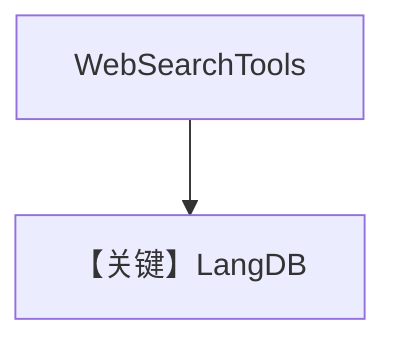

# web_search.md — 实现原理分析

> 源文件：`cookbook/90_models/langdb/web_search.py`

## 概述

**LangDB + WebSearchTools**，流式问法国新闻。

**核心配置一览：**

| 配置项 | 值 | 说明 |
|--------|-----|------|
| `model` | `LangDB(id="llama3-1-70b-instruct-v1.0")` | LangDB |
| `tools` | `[WebSearchTools()]` | 搜索 |
| `markdown` | `True` | Markdown |

## System Prompt 组装

Markdown 附加段；用户消息：`Whats happening in France?`

## 完整 API 请求

`LiteLLM/OpenAI` 兼容客户端经 LangDB → `chat.completions.create` + tools。

## Mermaid 流程图

## 关键源码文件索引

| 文件 | 关键 |
|------|------|
| `agno/models/langdb/langdb.py` | `LangDB` |
