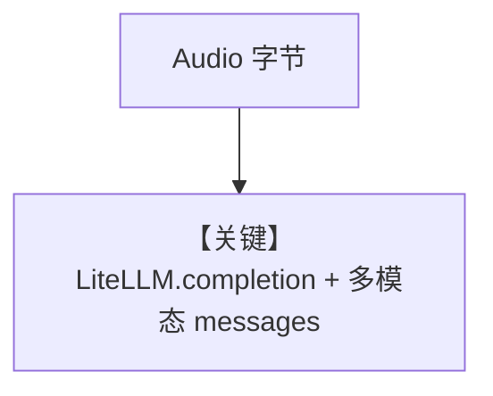

# audio_input_agent.md — 实现原理分析

<!-- cookbook-py-source:start -->
## 完整源码

```python
"""
Litellm Audio Input Agent
=========================

Cookbook example for `litellm/audio_input_agent.py`.
"""

import requests
from agno.agent import Agent
from agno.media import Audio
from agno.models.litellm import LiteLLM

# ---------------------------------------------------------------------------
# Create Agent
# ---------------------------------------------------------------------------

# Fetch the QA audio file and convert it to a base64 encoded string
url = "https://agno-public.s3.us-east-1.amazonaws.com/demo_data/QA-01.mp3"
response = requests.get(url)
response.raise_for_status()
mp3_data = response.content

# Audio input requires specific audio-enabled models like gpt-4o-audio-preview
agent = Agent(
    model=LiteLLM(id="gpt-4o-audio-preview"),
    markdown=True,
)
agent.print_response(
    "What's the audio about?",
    audio=[Audio(content=mp3_data, format="mp3")],
    stream=True,
)

# ---------------------------------------------------------------------------
# Run Agent
# ---------------------------------------------------------------------------

if __name__ == "__main__":
    pass
```

<!-- cookbook-py-source:end -->

> 源文件：`cookbook/90_models/litellm/audio_input_agent.py`

## 概述

**`LiteLLM(id="gpt-4o-audio-preview")` + `Audio` 媒体**，流式问音频内容。

**核心配置一览：**

| 配置项 | 值 | 说明 |
|--------|-----|------|
| `model` | `LiteLLM(id="gpt-4o-audio-preview")` | 需支持音频输入 |
| `markdown` | `True` | Markdown |

## 核心组件解析

`LiteLLM.invoke`（`agno/models/litellm/chat.py` 约 L227–247）调用 `get_client().completion(**completion_kwargs)`（LiteLLM 统一入口）。

## System Prompt 组装

Markdown 附加段。用户消息：`What's the audio about?`，并传入 `audio=[Audio(...)]`。

## 完整 API 请求

```python
# litellm/chat.py：completion_kwargs["messages"] = _format_messages(...)
# get_client().completion(**completion_kwargs)
```

## Mermaid 流程图



## 关键源码文件索引

| 文件 | 关键 |
|------|------|
| `agno/models/litellm/chat.py` | `invoke` L227+ |
