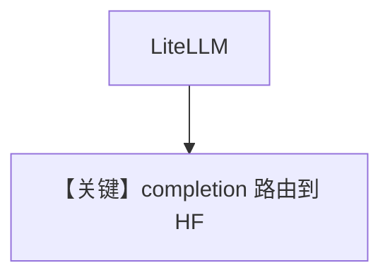

# basic.md — 实现原理分析

<!-- cookbook-py-source:start -->
## 完整源码

```python
"""
Litellm Basic
=============

Cookbook example for `litellm/basic.py`.
"""

import asyncio

from agno.agent import Agent
from agno.models.litellm import LiteLLM

# ---------------------------------------------------------------------------
# Create Agent
# ---------------------------------------------------------------------------

openai_agent = Agent(
    model=LiteLLM(
        id="huggingface/mistralai/Mistral-7B-Instruct-v0.2",
        top_p=0.95,
    ),
    markdown=True,
)

# ---------------------------------------------------------------------------
# Run Agent
# ---------------------------------------------------------------------------
if __name__ == "__main__":
    # --- Sync ---
    openai_agent.print_response("Whats happening in France?")

    # --- Sync + Streaming ---
    openai_agent.print_response("Share a 2 sentence horror story", stream=True)

    # --- Async ---
    asyncio.run(openai_agent.aprint_response("Share a 2 sentence horror story"))

    # --- Async + Streaming ---
    asyncio.run(
        openai_agent.aprint_response("Share a 2 sentence horror story", stream=True)
    )
```

<!-- cookbook-py-source:end -->

> 源文件：`cookbook/90_models/litellm/basic.py`

## 概述

**`LiteLLM` 指向 HuggingFace 路由模型** `huggingface/mistralai/Mistral-7B-Instruct-v0.2`，`top_p=0.95`，四种 `print_response`/`aprint_response` 模式。

**核心配置一览：**

| 配置项 | 值 | 说明 |
|--------|-----|------|
| `model` | `LiteLLM(id="huggingface/mistralai/Mistral-7B-Instruct-v0.2", top_p=0.95)` | LiteLLM 路由 |
| `markdown` | `True` | Markdown |

## 完整 API 请求

`LiteLLM.completion` 聚合消息与参数；底层路由到 HuggingFace 提供方。

## Mermaid 流程图



## 关键源码文件索引

| 文件 | 关键 |
|------|------|
| `agno/models/litellm/chat.py` | `invoke`、`get_request_params` |
