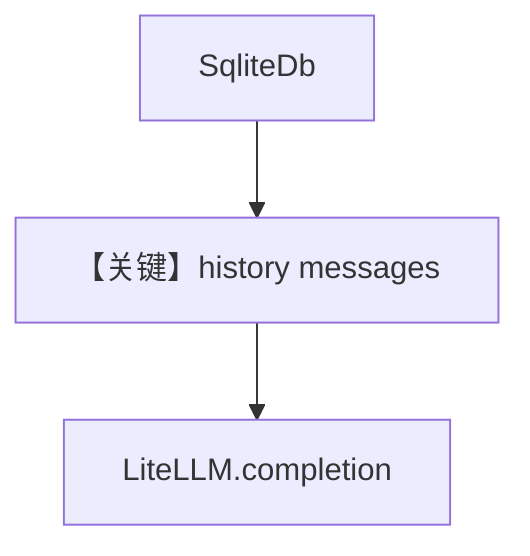

# db.md — 实现原理分析

<!-- cookbook-py-source:start -->
## 完整源码

```python
"""Run `uv pip install ddgs openai` to install dependencies."""

from agno.agent import Agent
from agno.db.sqlite import SqliteDb
from agno.models.litellm import LiteLLM
from agno.tools.websearch import WebSearchTools

# ---------------------------------------------------------------------------
# Create Agent
# ---------------------------------------------------------------------------

# Setup the database
db = SqliteDb(
    db_file="tmp/data.db",
)

# Add storage to the Agent
agent = Agent(
    model=LiteLLM(id="gpt-4o"),
    db=db,
    tools=[WebSearchTools()],
    add_history_to_context=True,
)

agent.print_response("How many people live in Canada?")
agent.print_response("What is their national anthem called?")

# ---------------------------------------------------------------------------
# Run Agent
# ---------------------------------------------------------------------------

if __name__ == "__main__":
    pass
```

<!-- cookbook-py-source:end -->

> 源文件：`cookbook/90_models/litellm/db.py`

## 概述

**`SqliteDb` + `LiteLLM(gpt-4o)` + WebSearch + 历史**，两轮对话。

**核心配置一览：**

| 配置项 | 值 | 说明 |
|--------|-----|------|
| `model` | `LiteLLM(id="gpt-4o")` | LiteLLM |
| `db` | `SqliteDb(db_file="tmp/data.db")` | 开发用 SQLite |
| `tools` | `[WebSearchTools()]` | 搜索 |
| `add_history_to_context` | `True` | 历史 |

## Mermaid 流程图



## 关键源码文件索引

| 文件 | 关键 |
|------|------|
| `agno/db/sqlite.py` | SqliteDb |
| `agno/models/litellm/chat.py` | `invoke` |
