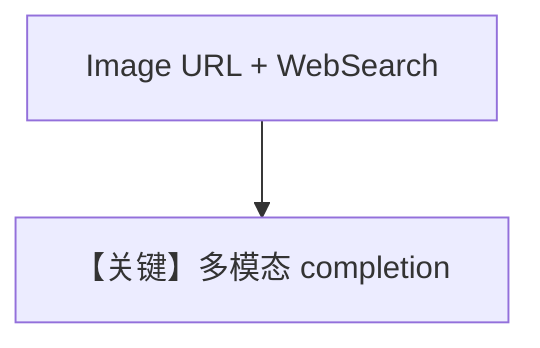

# image_agent.md — 实现原理分析

> 源文件：`cookbook/90_models/litellm/image_agent.py`

## 概述

**`LiteLLM(gpt-4o)` + WebSearch + 图像 URL**，流式。

**核心配置一览：**

| 配置项 | 值 | 说明 |
|--------|-----|------|
| `model` | `LiteLLM(id="gpt-4o")` | 多模态 |
| `tools` | `[WebSearchTools()]` | 搜索 |
| `markdown` | `True` | Markdown |

## System Prompt 组装

用户消息：`Tell me about this image and give me the latest news about it.`，`images=[Image(url=...)]`。

## 完整 API 请求

`LiteLLM._format_messages` 将图像并入 messages；`completion` 发往支持视觉的模型。

## Mermaid 流程图

## 关键源码文件索引

| 文件 | 关键 |
|------|------|
| `agno/models/litellm/chat.py` | `_format_messages` |
