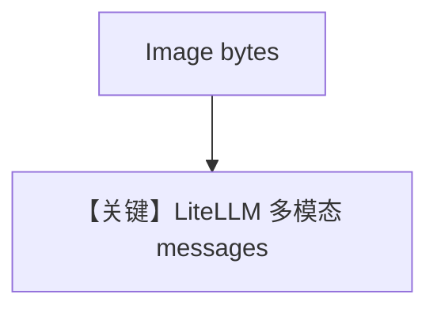

# image_agent_bytes.md — 实现原理分析

> 源文件：`cookbook/90_models/litellm/image_agent_bytes.py`

## 概述

与 `image_agent.py` 类似，图像为 **本地下载后的字节**（`Image(content=image_bytes)`）。

**核心配置一览：**

| 配置项 | 值 | 说明 |
|--------|-----|------|
| `model` | `LiteLLM(id="gpt-4o")` | 多模态 |
| `tools` | `[WebSearchTools()]` | 搜索 |
| `markdown` | `True` | Markdown |

## Mermaid 流程图

## 关键源码文件索引

| 文件 | 关键 |
|------|------|
| `agno/models/litellm/chat.py` | `invoke` |
