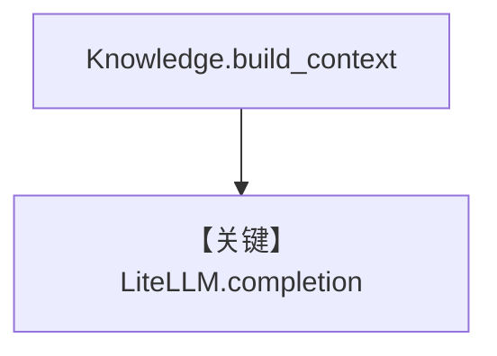

# knowledge.md — 实现原理分析

<!-- cookbook-py-source:start -->
## 完整源码

```python
"""
Litellm Knowledge
=================

Cookbook example for `litellm/knowledge.py`.
"""

from agno.agent import Agent
from agno.knowledge.knowledge import Knowledge
from agno.models.litellm import LiteLLM
from agno.vectordb.pgvector import PgVector

# ---------------------------------------------------------------------------
# Create Agent
# ---------------------------------------------------------------------------

db_url = "postgresql+psycopg://ai:ai@localhost:5532/ai"

knowledge = Knowledge(
    vector_db=PgVector(table_name="recipes", db_url=db_url),
)
# Add content to the knowledge
knowledge.insert(url="https://agno-public.s3.amazonaws.com/recipes/ThaiRecipes.pdf")

agent = Agent(model=LiteLLM(id="gpt-4o"), knowledge=knowledge)
agent.print_response("How to make Thai curry?", markdown=True)

# ---------------------------------------------------------------------------
# Run Agent
# ---------------------------------------------------------------------------

if __name__ == "__main__":
    pass
```

<!-- cookbook-py-source:end -->

> 源文件：`cookbook/90_models/litellm/knowledge.py`

## 概述

**`LiteLLM(gpt-4o)` + Knowledge(PgVector)**，Thai curry RAG。

**核心配置一览：**

| 配置项 | 值 | 说明 |
|--------|-----|------|
| `model` | `LiteLLM(id="gpt-4o")` | LiteLLM |
| `knowledge` | `Knowledge(PgVector(...))` | RAG |

## Mermaid 流程图



## 关键源码文件索引

| 文件 | 关键 |
|------|------|
| `agno/agent/_messages.py` | 3.3.13 |
