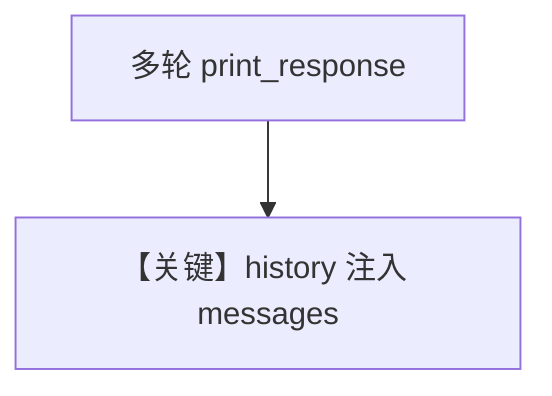

# memory.md — 实现原理分析

> 源文件：`cookbook/90_models/litellm/memory.py`

## 概述

**`add_history_to_context=True` + `num_history_runs=3` + description**，演示多轮记忆与 `get_session_messages()`。

**核心配置一览：**

| 配置项 | 值 | 说明 |
|--------|-----|------|
| `model` | `LiteLLM(id="gpt-4o")` | LiteLLM |
| `add_history_to_context` | `True` | 历史 |
| `num_history_runs` | `3` | 轮数 |
| `description` | `You are a helpful assistant that always responds in a polite, upbeat and positive manner.` | 角色 |

## System Prompt 组装

### description 原样

```text
You are a helpful assistant that always responds in a polite, upbeat and positive manner.
```

## Mermaid 流程图



## 关键源码文件索引

| 文件 | 关键 |
|------|------|
| `agno/agent/_messages.py` | `get_run_messages` |
