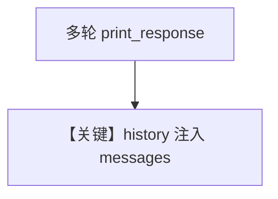

# memory.md — 实现原理分析

<!-- cookbook-py-source:start -->
## 完整源码

```python
"""
Litellm Memory
==============

Cookbook example for `litellm/memory.py`.
"""

from agno.agent import Agent
from agno.models.litellm import LiteLLM
from rich.pretty import pprint

# ---------------------------------------------------------------------------
# Create Agent
# ---------------------------------------------------------------------------

agent = Agent(
    model=LiteLLM(id="gpt-4o"),
    # Set add_history_to_context=true to add the previous chat history to the context sent to the Model.
    add_history_to_context=True,
    # Number of historical responses to add to the messages.
    num_history_runs=3,
    description="You are a helpful assistant that always responds in a polite, upbeat and positive manner.",
)

# -*- Create a run
agent.print_response("Share a 2 sentence horror story", stream=True)
# -*- Print the messages in the memory
pprint(
    [m.model_dump(include={"role", "content"}) for m in agent.get_session_messages()]
)

# -*- Ask a follow up question that continues the conversation
agent.print_response("What was my first message?", stream=True)
# -*- Print the messages in the memory
pprint(
    [m.model_dump(include={"role", "content"}) for m in agent.get_session_messages()]
)

# ---------------------------------------------------------------------------
# Run Agent
# ---------------------------------------------------------------------------

if __name__ == "__main__":
    pass
```

<!-- cookbook-py-source:end -->

> 源文件：`cookbook/90_models/litellm/memory.py`

## 概述

**`add_history_to_context=True` + `num_history_runs=3` + description**，演示多轮记忆与 `get_session_messages()`。

**核心配置一览：**

| 配置项 | 值 | 说明 |
|--------|-----|------|
| `model` | `LiteLLM(id="gpt-4o")` | LiteLLM |
| `add_history_to_context` | `True` | 历史 |
| `num_history_runs` | `3` | 轮数 |
| `description` | `You are a helpful assistant that always responds in a polite, upbeat and positive manner.` | 角色 |

## System Prompt 组装

### description 原样

```text
You are a helpful assistant that always responds in a polite, upbeat and positive manner.
```

## Mermaid 流程图



## 关键源码文件索引

| 文件 | 关键 |
|------|------|
| `agno/agent/_messages.py` | `get_run_messages` |
