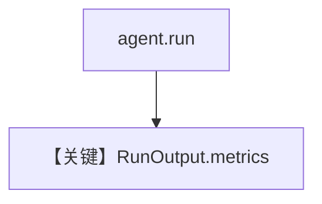

# metrics.md — 实现原理分析

> 源文件：`cookbook/90_models/litellm/metrics.py`

## 概述

**`LiteLLM(gpt-4o)` + YFinance**，打印 `RunOutput` 与 assistant 消息级 **metrics**（与 Groq metrics  cookbook 同思路）。

**核心配置一览：**

| 配置项 | 值 | 说明 |
|--------|-----|------|
| `model` | `LiteLLM(id="gpt-4o")` | LiteLLM |
| `tools` | `[YFinanceTools()]` | 工具 |
| `markdown` | `True` | Markdown |

## 完整 API 请求

`LiteLLM.completion`；用量字段依赖提供方与 LiteLLM 解析。

## Mermaid 流程图

## 关键源码文件索引

| 文件 | 关键 |
|------|------|
| `agno/models/litellm/chat.py` | `invoke` |
| `agno/run/agent.py` | `RunOutput` |
