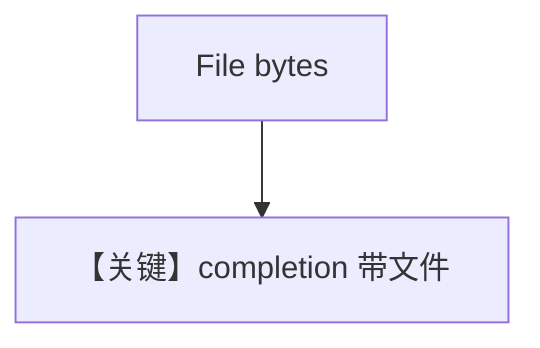

# pdf_input_bytes.md — 实现原理分析

<!-- cookbook-py-source:start -->
## 完整源码

```python
"""
Litellm Pdf Input Bytes
=======================

Cookbook example for `litellm/pdf_input_bytes.py`.
"""

from pathlib import Path

from agno.agent import Agent
from agno.media import File
from agno.models.litellm import LiteLLM
from agno.utils.media import download_file

# ---------------------------------------------------------------------------
# Create Agent
# ---------------------------------------------------------------------------

pdf_path = Path(__file__).parent.joinpath("ThaiRecipes.pdf")

download_file(
    "https://agno-public.s3.amazonaws.com/recipes/ThaiRecipes.pdf", str(pdf_path)
)

agent = Agent(
    model=LiteLLM(id="openai/gpt-4o"),
    markdown=True,
)

agent.print_response(
    "Summarize the contents of the attached file.",
    files=[
        File(
            content=pdf_path.read_bytes(),
        ),
    ],
)

# ---------------------------------------------------------------------------
# Run Agent
# ---------------------------------------------------------------------------

if __name__ == "__main__":
    pass
```

<!-- cookbook-py-source:end -->

> 源文件：`cookbook/90_models/litellm/pdf_input_bytes.py`

## 概述

**`LiteLLM(id="openai/gpt-4o")` + `File(content=bytes)`** 附件总结。

**核心配置一览：**

| 配置项 | 值 | 说明 |
|--------|-----|------|
| `model` | `LiteLLM(id="openai/gpt-4o")` | 路由前缀 openai/ |
| `markdown` | `True` | Markdown |

用户消息：`Summarize the contents of the attached file.`

## Mermaid 流程图



## 关键源码文件索引

| 文件 | 关键 |
|------|------|
| `agno/models/litellm/chat.py` | `_format_messages` |
