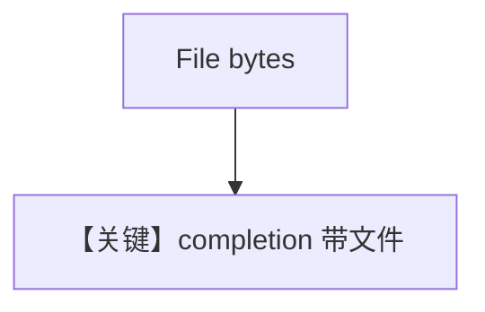

# pdf_input_bytes.md — 实现原理分析

> 源文件：`cookbook/90_models/litellm/pdf_input_bytes.py`

## 概述

**`LiteLLM(id="openai/gpt-4o")` + `File(content=bytes)`** 附件总结。

**核心配置一览：**

| 配置项 | 值 | 说明 |
|--------|-----|------|
| `model` | `LiteLLM(id="openai/gpt-4o")` | 路由前缀 openai/ |
| `markdown` | `True` | Markdown |

用户消息：`Summarize the contents of the attached file.`

## Mermaid 流程图

## 关键源码文件索引

| 文件 | 关键 |
|------|------|
| `agno/models/litellm/chat.py` | `_format_messages` |
