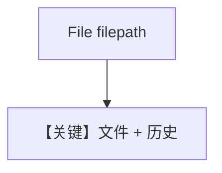

# pdf_input_local.md — 实现原理分析

<!-- cookbook-py-source:start -->
## 完整源码

```python
"""
Litellm Pdf Input Local
=======================

Cookbook example for `litellm/pdf_input_local.py`.
"""

from pathlib import Path

from agno.agent import Agent
from agno.media import File
from agno.models.litellm import LiteLLM
from agno.utils.media import download_file

# ---------------------------------------------------------------------------
# Create Agent
# ---------------------------------------------------------------------------

pdf_path = Path(__file__).parent.joinpath("ThaiRecipes.pdf")

# Download the file using the download_file function
download_file(
    "https://agno-public.s3.amazonaws.com/recipes/ThaiRecipes.pdf", str(pdf_path)
)

agent = Agent(
    model=LiteLLM(id="gpt-4o"),
    markdown=True,
    add_history_to_context=True,
)

agent.print_response(
    "What is the recipe for Gaeng Som Phak Ruam? Also what are the health benefits. Refer to the attached file.",
    files=[File(filepath=pdf_path)],
)

# ---------------------------------------------------------------------------
# Run Agent
# ---------------------------------------------------------------------------

if __name__ == "__main__":
    pass
```

<!-- cookbook-py-source:end -->

> 源文件：`cookbook/90_models/litellm/pdf_input_local.py`

## 概述

**`File(filepath=...)` 本地路径 + `add_history_to_context=True`**，问具体菜谱与健康信息。

**核心配置一览：**

| 配置项 | 值 | 说明 |
|--------|-----|------|
| `model` | `LiteLLM(id="gpt-4o")` | LiteLLM |
| `markdown` | `True` | Markdown |
| `add_history_to_context` | `True` | 历史 |

## Mermaid 流程图



## 关键源码文件索引

| 文件 | 关键 |
|------|------|
| `agno/models/litellm/chat.py` | `invoke` |
