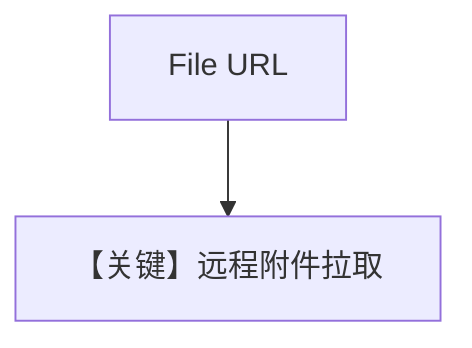

# pdf_input_url.md — 实现原理分析

> 源文件：`cookbook/90_models/litellm/pdf_input_url.py`

## 概述

**`File(url=...)` 远程 PDF + 历史**，从附件推荐菜谱。

**核心配置一览：**

| 配置项 | 值 | 说明 |
|--------|-----|------|
| `model` | `LiteLLM(id="gpt-4o")` | LiteLLM |
| `markdown` | `True` | Markdown |
| `add_history_to_context` | `True` | 历史 |

用户消息：`Suggest me a recipe from the attached file.`

## Mermaid 流程图

## 关键源码文件索引

| 文件 | 关键 |
|------|------|
| `agno/media/file.py` | `File` |
