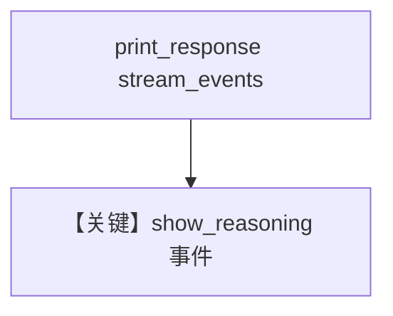

# reasoning_agent.md — 实现原理分析

> 源文件：`cookbook/90_models/litellm/reasoning_agent.py`

## 概述

**`LiteLLM(id="deepseek/deepseek-reasoner")` + `stream_events=True` + `show_reasoning=True`**，展示推理内容流。

**核心配置一览：**

| 配置项 | 值 | 说明 |
|--------|-----|------|
| `model` | `LiteLLM(id="deepseek/deepseek-reasoner")` | 推理模型 |
| `markdown` | `True` | Markdown |

任务变量：`9.11 and 9.9 -- which is bigger?`

## 运行机制与因果链

推理 token/片段经 Agent 事件流暴露（`show_reasoning=True`）。

## Mermaid 流程图

## 关键源码文件索引

| 文件 | 关键 |
|------|------|
| `agno/agent/_response.py` | 推理与流事件 |
