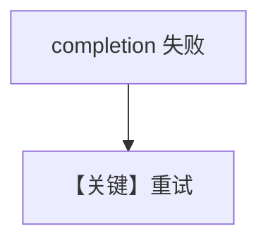

# retry.md — 实现原理分析

> 源文件：`cookbook/90_models/litellm/retry.py`

## 概述

**错误 `LiteLLM` id + 重试三件套**。

**核心配置一览：**

| 配置项 | 值 | 说明 |
|--------|-----|------|
| `model` | `LiteLLM(id="litellm-wrong-id", retries=3, delay_between_retries=1, exponential_backoff=True)` | LiteLLM |

## 完整 API 请求

`completion` 失败重试。

## Mermaid 流程图

## 关键源码文件索引

| 文件 | 关键 |
|------|------|
| `agno/models/litellm/chat.py` | `invoke` |
