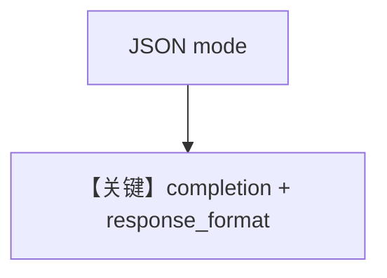

# structured_output.md — 实现原理分析

> 源文件：`cookbook/90_models/litellm/structured_output.py`

## 概述

**`LiteLLM(gpt-4o)` + `MovieScript` + `use_json_mode=True`**。

**核心配置一览：**

| 配置项 | 值 | 说明 |
|--------|-----|------|
| `model` | `LiteLLM(id="gpt-4o")` | LiteLLM |
| `description` | `You write movie scripts.` | 角色 |
| `output_schema` | `MovieScript` | 结构 |
| `use_json_mode` | `True` | JSON |

### description 原样

```text
You write movie scripts.
```

用户消息：`New York`

## Mermaid 流程图



## 关键源码文件索引

| 文件 | 关键 |
|------|------|
| `agno/models/litellm/chat.py` | `invoke` |
