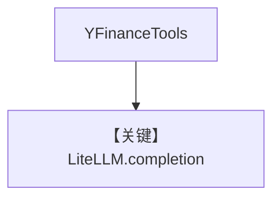

# tool_use.md — 实现原理分析

> 源文件：`cookbook/90_models/litellm/tool_use.py`

## 概述

**`LiteLLM(gpt-4o, name="LiteLLM")` + YFinance**，同步/流式/异步。

**核心配置一览：**

| 配置项 | 值 | 说明 |
|--------|-----|------|
| `model` | `LiteLLM(id="gpt-4o", name="LiteLLM")` | LiteLLM |
| `markdown` | `True` | Markdown |
| `tools` | `[YFinanceTools()]` | 金融 |

## Mermaid 流程图

## 关键源码文件索引

| 文件 | 关键 |
|------|------|
| `agno/models/litellm/chat.py` | `invoke` |
