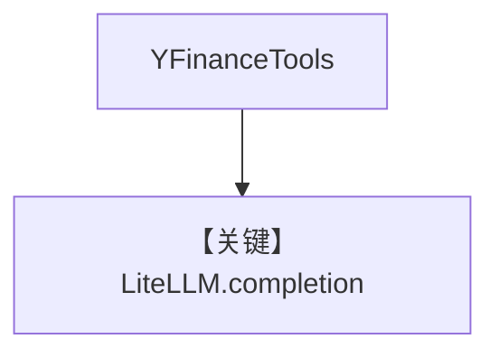

# tool_use.md — 实现原理分析

<!-- cookbook-py-source:start -->
## 完整源码

```python
"""
Litellm Tool Use
================

Cookbook example for `litellm/tool_use.py`.
"""

import asyncio

from agno.agent import Agent
from agno.models.litellm import LiteLLM
from agno.tools.yfinance import YFinanceTools

# ---------------------------------------------------------------------------
# Create Agent
# ---------------------------------------------------------------------------

openai_agent = Agent(
    model=LiteLLM(
        id="gpt-4o",
        name="LiteLLM",
    ),
    markdown=True,
    tools=[YFinanceTools()],
)

# Ask a question that would likely trigger tool use

# ---------------------------------------------------------------------------
# Run Agent
# ---------------------------------------------------------------------------
if __name__ == "__main__":
    # --- Sync ---
    openai_agent.print_response("How is TSLA stock doing right now?")

    # --- Sync + Streaming ---
    openai_agent.print_response("Whats happening in France?", stream=True)

    # --- Async ---
    asyncio.run(openai_agent.aprint_response("What is happening in France?"))
```

<!-- cookbook-py-source:end -->

> 源文件：`cookbook/90_models/litellm/tool_use.py`

## 概述

**`LiteLLM(gpt-4o, name="LiteLLM")` + YFinance**，同步/流式/异步。

**核心配置一览：**

| 配置项 | 值 | 说明 |
|--------|-----|------|
| `model` | `LiteLLM(id="gpt-4o", name="LiteLLM")` | LiteLLM |
| `markdown` | `True` | Markdown |
| `tools` | `[YFinanceTools()]` | 金融 |

## Mermaid 流程图



## 关键源码文件索引

| 文件 | 关键 |
|------|------|
| `agno/models/litellm/chat.py` | `invoke` |
