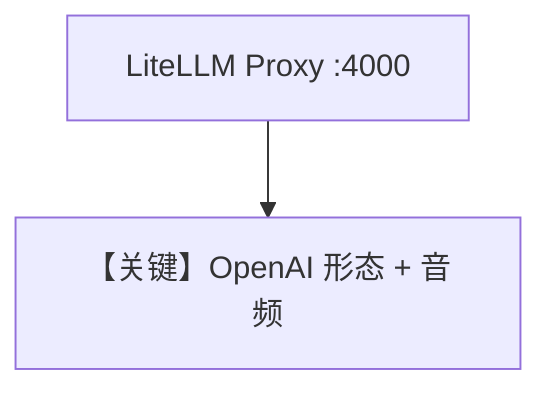

# audio_input_agent.md — 实现原理分析

<!-- cookbook-py-source:start -->
## 完整源码

```python
"""
Please first install litellm[proxy] by running: uv pip install 'litellm[proxy]'

Before running this script, you need to start the LiteLLM server:

litellm --model gpt-4o-audio-preview --host 127.0.0.1 --port 4000
"""

import requests
from agno.agent import Agent, RunResponse  # noqa
from agno.media import Audio
from agno.models.litellm import LiteLLMOpenAI

# ---------------------------------------------------------------------------
# Create Agent
# ---------------------------------------------------------------------------

# Fetch the QA audio file and convert it to a base64 encoded string
url = "https://agno-public.s3.us-east-1.amazonaws.com/demo_data/QA-01.mp3"
response = requests.get(url)
response.raise_for_status()
mp3_data = response.content

# Provide the agent with the audio file and get result as text
# Note: Audio input requires specific audio-enabled models like gpt-4o-audio-preview
agent = Agent(
    model=LiteLLMOpenAI(id="gpt-4o-audio-preview"),
    markdown=True,
)
agent.print_response(
    "What is in this audio?", audio=[Audio(content=mp3_data, format="mp3")], stream=True
)

# ---------------------------------------------------------------------------
# Run Agent
# ---------------------------------------------------------------------------

if __name__ == "__main__":
    pass
```

<!-- cookbook-py-source:end -->

> 源文件：`cookbook/90_models/litellm_openai/audio_input_agent.py`

## 概述

需 **本地 LiteLLM Proxy**（`litellm --model gpt-4o-audio-preview`）。**`LiteLLMOpenAI`** 指向代理 OpenAI 兼容接口，**`Audio`** 输入。

**核心配置一览：**

| 配置项 | 值 | 说明 |
|--------|-----|------|
| `model` | `LiteLLMOpenAI(id="gpt-4o-audio-preview")` | 经代理 |
| `markdown` | `True` | Markdown |

## 架构分层

与 `litellm/audio_input_agent.py` 不同：此处 **`LiteLLMOpenAI`** 通常走 **OpenAI 兼容 base_url**（本地 4000），仍由 LiteLLM 路由。

## Mermaid 流程图



## 关键源码文件索引

| 文件 | 关键 |
|------|------|
| `agno/models/litellm/litellm_openai.py` | `LiteLLMOpenAI` L10+（继承 `OpenAILike`） |
