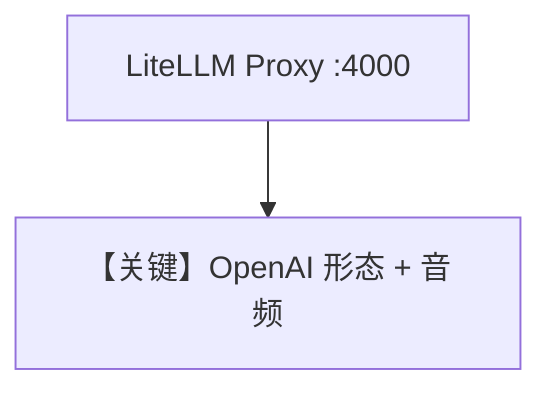

# audio_input_agent.md — 实现原理分析

> 源文件：`cookbook/90_models/litellm_openai/audio_input_agent.py`

## 概述

需 **本地 LiteLLM Proxy**（`litellm --model gpt-4o-audio-preview`）。**`LiteLLMOpenAI`** 指向代理 OpenAI 兼容接口，**`Audio`** 输入。

**核心配置一览：**

| 配置项 | 值 | 说明 |
|--------|-----|------|
| `model` | `LiteLLMOpenAI(id="gpt-4o-audio-preview")` | 经代理 |
| `markdown` | `True` | Markdown |

## 架构分层

与 `litellm/audio_input_agent.py` 不同：此处 **`LiteLLMOpenAI`** 通常走 **OpenAI 兼容 base_url**（本地 4000），仍由 LiteLLM 路由。

## Mermaid 流程图

## 关键源码文件索引

| 文件 | 关键 |
|------|------|
| `agno/models/litellm/litellm_openai.py` | `LiteLLMOpenAI` L10+（继承 `OpenAILike`） |
