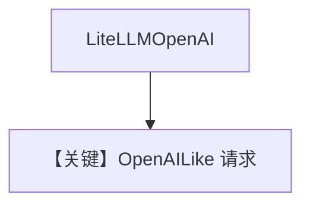

# basic.md — 实现原理分析

<!-- cookbook-py-source:start -->
## 完整源码

```python
"""
Litellm Openai Basic
====================

Cookbook example for `litellm_openai/basic.py`.
"""

from agno.agent import Agent, RunOutput  # noqa
from agno.models.litellm import LiteLLMOpenAI

# ---------------------------------------------------------------------------
# Create Agent
# ---------------------------------------------------------------------------

agent = Agent(model=LiteLLMOpenAI(id="gpt-4o"), markdown=True)

# Get the response in a variable
# run: RunOutput = agent.run("Share a 2 sentence horror story")
# print(run.content)

# Print the response in the terminal

# ---------------------------------------------------------------------------
# Run Agent
# ---------------------------------------------------------------------------
if __name__ == "__main__":
    # --- Sync ---
    agent.print_response("Share a 2 sentence horror story")

    # --- Sync + Streaming ---
    agent.print_response("Share a 2 sentence horror story", stream=True)
```

<!-- cookbook-py-source:end -->

> 源文件：`cookbook/90_models/litellm_openai/basic.py`

## 概述

**`LiteLLMOpenAI(id="gpt-4o")`** 同步与流式 horror story。

**核心配置一览：**

| 配置项 | 值 | 说明 |
|--------|-----|------|
| `model` | `LiteLLMOpenAI(id="gpt-4o")` | OpenAI 兼容代理/路由 |
| `markdown` | `True` | Markdown |

## 完整 API 请求

`OpenAILike` → `chat.completions.create` 形态（见 `agno/models/openai/like.py`）。

## Mermaid 流程图



## 关键源码文件索引

| 文件 | 关键 |
|------|------|
| `agno/models/litellm/litellm_openai.py` | `LiteLLMOpenAI` |
| `agno/models/openai/like.py` | `OpenAILike` |
