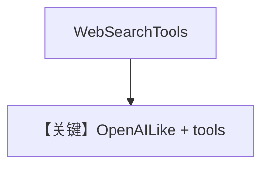

# tool_use.md — 实现原理分析

> 源文件：`cookbook/90_models/litellm_openai/tool_use.py`

## 概述

**`LiteLLMOpenAI(gpt-4o)` + WebSearchTools**。

**核心配置一览：**

| 配置项 | 值 | 说明 |
|--------|-----|------|
| `model` | `LiteLLMOpenAI(id="gpt-4o")` | OpenAILike |
| `tools` | `[WebSearchTools()]` | 搜索 |
| `markdown` | `True` | Markdown |

用户消息：`Whats happening in France?`

## Mermaid 流程图

## 关键源码文件索引

| 文件 | 关键 |
|------|------|
| `agno/models/litellm/litellm_openai.py` | `LiteLLMOpenAI` |
