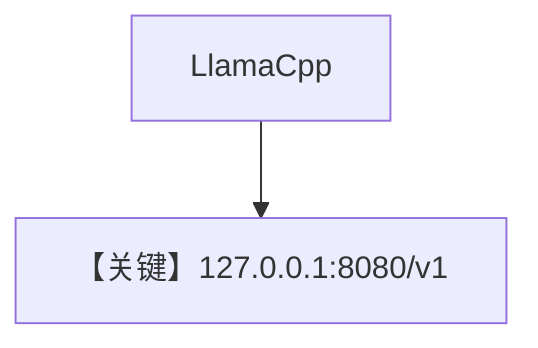

# basic.md — 实现原理分析

> 源文件：`cookbook/90_models/llama_cpp/basic.py`

## 概述

**`LlamaCpp` 连接本地 llama.cpp OpenAI 兼容服务**（默认 `http://127.0.0.1:8080/v1`），同步与流式。

**核心配置一览：**

| 配置项 | 值 | 说明 |
|--------|-----|------|
| `model` | `LlamaCpp(id="ggml-org/gpt-oss-20b-GGUF")` | OpenAILike |
| `markdown` | `True` | Markdown |

## 完整 API 请求

`OpenAILike`：`chat.completions.create` 指向本地 server。

## Mermaid 流程图

## 关键源码文件索引

| 文件 | 关键 |
|------|------|
| `agno/models/llama_cpp/llama_cpp.py` | `LlamaCpp` L7+ |
