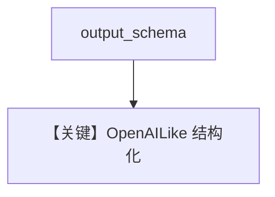

# structured_output.md — 实现原理分析

<!-- cookbook-py-source:start -->
## 完整源码

```python
"""
Llama Cpp Structured Output
===========================

Cookbook example for `llama_cpp/structured_output.py`.
"""

from typing import List

from agno.agent import Agent
from agno.models.llama_cpp import LlamaCpp
from agno.run.agent import RunOutput
from pydantic import BaseModel, Field
from rich.pretty import pprint  # noqa

# ---------------------------------------------------------------------------
# Create Agent
# ---------------------------------------------------------------------------


class MovieScript(BaseModel):
    name: str = Field(..., description="Give a name to this movie")
    setting: str = Field(
        ..., description="Provide a nice setting for a blockbuster movie."
    )
    ending: str = Field(
        ...,
        description="Ending of the movie. If not available, provide a happy ending.",
    )
    genre: str = Field(
        ...,
        description="Genre of the movie. If not available, select action, thriller or romantic comedy.",
    )
    characters: List[str] = Field(..., description="Name of characters for this movie.")
    storyline: str = Field(
        ..., description="3 sentence storyline for the movie. Make it exciting!"
    )


# Agent that returns a structured output
structured_output_agent = Agent(
    model=LlamaCpp(id="ggml-org/gpt-oss-20b-GGUF"),
    description="You write movie scripts.",
    output_schema=MovieScript,
)

# Run the agent synchronously
structured_output_response: RunOutput = structured_output_agent.run("New York")
pprint(structured_output_response.content)

# ---------------------------------------------------------------------------
# Run Agent
# ---------------------------------------------------------------------------

if __name__ == "__main__":
    pass
```

<!-- cookbook-py-source:end -->

> 源文件：`cookbook/90_models/llama_cpp/structured_output.py`

## 概述

**`LlamaCpp` + `MovieScript`**，`run()` 后 `pprint(content)`。

**核心配置一览：**

| 配置项 | 值 | 说明 |
|--------|-----|------|
| `model` | `LlamaCpp(id="ggml-org/gpt-oss-20b-GGUF")` | 本地 |
| `description` | `You write movie scripts.` | 角色 |
| `output_schema` | `MovieScript` | 结构 |

### description 原样

```text
You write movie scripts.
```

## Mermaid 流程图



## 关键源码文件索引

| 文件 | 关键 |
|------|------|
| `agno/models/llama_cpp/llama_cpp.py` | `supports_*` 继承 OpenAILike |
