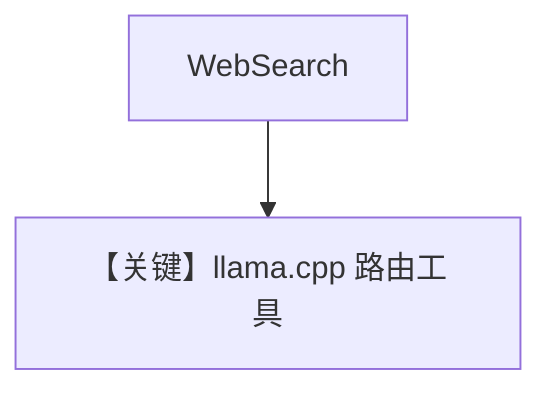

# tool_use.md — 实现原理分析

<!-- cookbook-py-source:start -->
## 完整源码

```python
"""Run `uv pip install ddgs` to install dependencies."""

from agno.agent import Agent
from agno.models.llama_cpp import LlamaCpp
from agno.tools.websearch import WebSearchTools

# ---------------------------------------------------------------------------
# Create Agent
# ---------------------------------------------------------------------------

agent = Agent(
    model=LlamaCpp(id="ggml-org/gpt-oss-20b-GGUF"),
    tools=[WebSearchTools()],
    markdown=True,
)

# ---------------------------------------------------------------------------
# Run Agent
# ---------------------------------------------------------------------------
if __name__ == "__main__":
    # --- Sync ---
    agent.print_response("Whats happening in France?")

    # --- Sync + Streaming ---
    agent.print_response("Whats happening in France?", stream=True)
```

<!-- cookbook-py-source:end -->

> 源文件：`cookbook/90_models/llama_cpp/tool_use.py`

## 概述

**`LlamaCpp` + WebSearchTools**，同步与流式。

**核心配置一览：**

| 配置项 | 值 | 说明 |
|--------|-----|------|
| `model` | `LlamaCpp(id="ggml-org/gpt-oss-20b-GGUF")` | 本地 |
| `tools` | `[WebSearchTools()]` | 搜索 |
| `markdown` | `True` | Markdown |

## Mermaid 流程图



## 关键源码文件索引

| 文件 | 关键 |
|------|------|
| `agno/models/llama_cpp/llama_cpp.py` | `LlamaCpp` |
