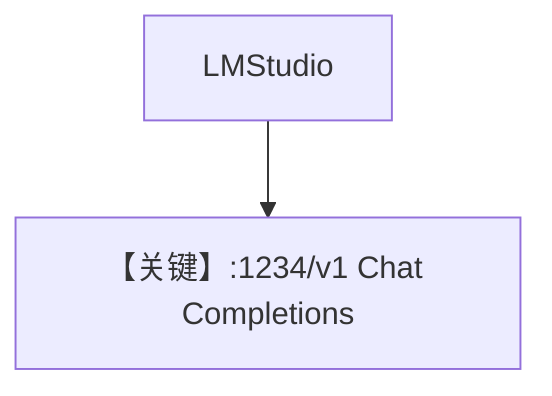

# basic.md — 实现原理分析

<!-- cookbook-py-source:start -->
## 完整源码

```python
"""
Lmstudio Basic
==============

Cookbook example for `lmstudio/basic.py`.
"""

from agno.agent import Agent, RunOutput  # noqa
from agno.models.lmstudio import LMStudio

# ---------------------------------------------------------------------------
# Create Agent
# ---------------------------------------------------------------------------

agent = Agent(model=LMStudio(id="qwen2.5-7b-instruct-1m"), markdown=True)

# Get the response in a variable
# run: RunOutput = agent.run("Share a 2 sentence horror story")
# print(run.content)

# Print the response in the terminal

# ---------------------------------------------------------------------------
# Run Agent
# ---------------------------------------------------------------------------
if __name__ == "__main__":
    # --- Sync ---
    agent.print_response("Share a 2 sentence horror story")

    # --- Sync + Streaming ---
    agent.print_response("Share a 2 sentence horror story", stream=True)
```

<!-- cookbook-py-source:end -->

> 源文件：`cookbook/90_models/lmstudio/basic.py`

## 概述

**`LMStudio` 默认连接 `http://127.0.0.1:1234/v1`**（`lmstudio.py`），同步与流式。

**核心配置一览：**

| 配置项 | 值 | 说明 |
|--------|-----|------|
| `model` | `LMStudio(id="qwen2.5-7b-instruct-1m")` | 本地 LM Studio |
| `markdown` | `True` | Markdown |

## Mermaid 流程图



## 关键源码文件索引

| 文件 | 关键 |
|------|------|
| `agno/models/lmstudio/lmstudio.py` | `LMStudio` L7+，`supports_json_schema_outputs` |
