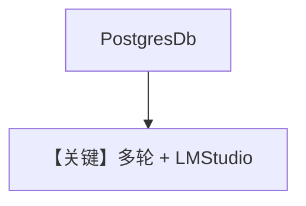

# db.md — 实现原理分析

> 源文件：`cookbook/90_models/lmstudio/db.py`

## 概述

**`PostgresDb` + LM Studio 模型 + WebSearch + 历史**。

**核心配置一览：**

| 配置项 | 值 | 说明 |
|--------|-----|------|
| `model` | `LMStudio(id="qwen2.5-7b-instruct-1m")` | 本地 |
| `db` | `PostgresDb(db_url=...)` | PG |
| `tools` | `[WebSearchTools()]` | 搜索 |
| `add_history_to_context` | `True` | 历史 |

## Mermaid 流程图

## 关键源码文件索引

| 文件 | 关键 |
|------|------|
| `agno/models/lmstudio/lmstudio.py` | `LMStudio` |
