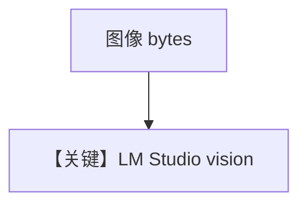

# image_agent.md — 实现原理分析

<!-- cookbook-py-source:start -->
## 完整源码

```python
"""
Lmstudio Image Agent
====================

Cookbook example for `lmstudio/image_agent.py`.
"""

import httpx
from agno.agent import Agent
from agno.media import Image
from agno.models.lmstudio import LMStudio

# ---------------------------------------------------------------------------
# Create Agent
# ---------------------------------------------------------------------------

agent = Agent(
    model=LMStudio(id="llama3.2-vision"),
    markdown=True,
)

response = httpx.get(
    "https://upload.wikimedia.org/wikipedia/commons/0/0c/GoldenGateBridge-001.jpg"
)

agent.print_response(
    "Tell me about this image",
    images=[Image(content=response.content)],
    stream=True,
)

# ---------------------------------------------------------------------------
# Run Agent
# ---------------------------------------------------------------------------

if __name__ == "__main__":
    pass
```

<!-- cookbook-py-source:end -->

> 源文件：`cookbook/90_models/lmstudio/image_agent.py`

## 概述

**`LMStudio(id="llama3.2-vision")` + httpx 拉取图片字节 + `Image(content)`**，流式。

**核心配置一览：**

| 配置项 | 值 | 说明 |
|--------|-----|------|
| `model` | `LMStudio(id="llama3.2-vision")` | 视觉模型名（本地加载） |
| `markdown` | `True` | Markdown |

用户消息：`Tell me about this image`

## Mermaid 流程图



## 关键源码文件索引

| 文件 | 关键 |
|------|------|
| `agno/models/lmstudio/lmstudio.py` | `LMStudio` |
