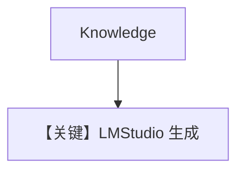

# knowledge.md — 实现原理分析

> 源文件：`cookbook/90_models/lmstudio/knowledge.py`

## 概述

**`LMStudio` + Knowledge(PgVector)**，Thai curry。

**核心配置一览：**

| 配置项 | 值 | 说明 |
|--------|-----|------|
| `model` | `LMStudio(id="qwen2.5-7b-instruct-1m")` | 本地 |
| `knowledge` | `Knowledge(PgVector(...))` | RAG |

## Mermaid 流程图

## 关键源码文件索引

| 文件 | 关键 |
|------|------|
| `agno/agent/_messages.py` | 3.3.13 |
