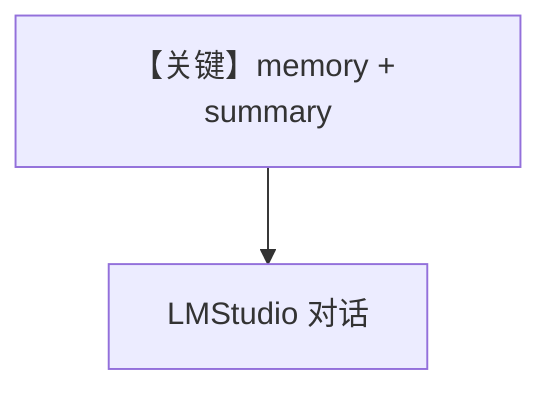

# memory.md — 实现原理分析

> 源文件：`cookbook/90_models/lmstudio/memory.py`

## 概述

**`PostgresDb` + `update_memory_on_run=True` + `enable_session_summaries=True`**，多轮个人信息与回顾。

**核心配置一览：**

| 配置项 | 值 | 说明 |
|--------|-----|------|
| `model` | `LMStudio(id="qwen2.5-7b-instruct-1m")` | 本地 |
| `db` | `PostgresDb(...)` | 持久化 |
| `update_memory_on_run` | `True` | 用户记忆 |
| `enable_session_summaries` | `True` | 会话摘要 |

## Mermaid 流程图

## 关键源码文件索引

| 文件 | 关键 |
|------|------|
| `agno/agent/_messages.py` | 3.3.9 memories |
