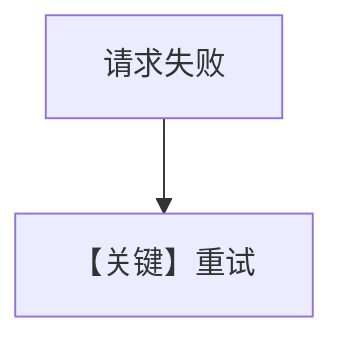

# retry.md — 实现原理分析

> 源文件：`cookbook/90_models/lmstudio/retry.py`

## 概述

**`LMStudio` 错误 id + 重试**。

**核心配置一览：**

| 配置项 | 值 | 说明 |
|--------|-----|------|
| `model` | `LMStudio(id="lmstudio-wrong-id", retries=3, delay_between_retries=1, exponential_backoff=True)` | LM Studio |

## Mermaid 流程图

## 关键源码文件索引

| 文件 | 关键 |
|------|------|
| `agno/models/lmstudio/lmstudio.py` | `LMStudio` |
