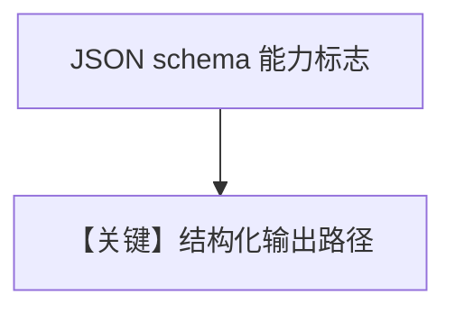

# structured_output.md — 实现原理分析

> 源文件：`cookbook/90_models/lmstudio/structured_output.py`

## 概述

**`LMStudio` + `MovieScript`**，`run()` + pprint。

**核心配置一览：**

| 配置项 | 值 | 说明 |
|--------|-----|------|
| `model` | `LMStudio(id="qwen2.5-7b-instruct-1m")` | 本地 |
| `description` | `You write movie scripts.` | 角色 |
| `output_schema` | `MovieScript` | 结构 |

`LMStudio` 默认 **`supports_json_schema_outputs: bool = True`**（`lmstudio.py`），影响 `_messages.py` 中 JSON 提示分支。

### description 原样

```text
You write movie scripts.
```

## Mermaid 流程图



## 关键源码文件索引

| 文件 | 关键 |
|------|------|
| `agno/models/lmstudio/lmstudio.py` | `supports_json_schema_outputs` |
