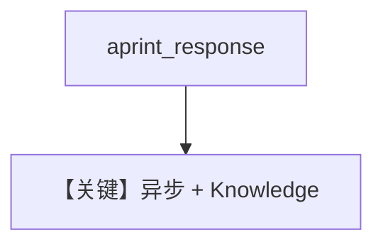

# async_knowledge.md — 实现原理分析

> 源文件：`cookbook/90_models/meta/llama/async_knowledge.py`

## 概述

**`asyncio.run(agent.aprint_response(...))` + `Llama` + Knowledge(PgVector)**，异步入口的 RAG 示例。

**核心配置一览：**

| 配置项 | 值 | 说明 |
|--------|-----|------|
| `model` | `Llama(id="Llama-4-Maverick-17B-128E-Instruct-FP8")` | Meta Llama API |
| `knowledge` | `Knowledge(PgVector(...))` | RAG |

## 核心组件解析

`Llama.invoke`（`agno/models/meta/llama.py` 约 L212+）使用 `get_client().chat.completions.create`；异步路径用 `ainvoke`。

## Mermaid 流程图

## 关键源码文件索引

| 文件 | 关键 |
|------|------|
| `agno/models/meta/llama.py` | `Llama` `ainvoke` |
