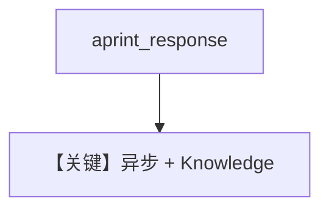

# async_knowledge.md — 实现原理分析

<!-- cookbook-py-source:start -->
## 完整源码

```python
"""Run `uv pip install ddgs sqlalchemy pgvector pypdf llama-api-client` to install dependencies."""

import asyncio

from agno.agent import Agent
from agno.knowledge.knowledge import Knowledge
from agno.models.meta import Llama
from agno.vectordb.pgvector import PgVector

# ---------------------------------------------------------------------------
# Create Agent
# ---------------------------------------------------------------------------

db_url = "postgresql+psycopg://ai:ai@localhost:5532/ai"

knowledge = Knowledge(
    vector_db=PgVector(table_name="recipes", db_url=db_url),
)
# Add content to the knowledge
knowledge.insert(url="https://agno-public.s3.amazonaws.com/recipes/ThaiRecipes.pdf")

agent = Agent(
    model=Llama(id="Llama-4-Maverick-17B-128E-Instruct-FP8"), knowledge=knowledge
)

# ---------------------------------------------------------------------------
# Run Agent
# ---------------------------------------------------------------------------

if __name__ == "__main__":
    # Create and use the agent
    asyncio.run(agent.aprint_response("How to make Thai curry?", markdown=True))
```

<!-- cookbook-py-source:end -->

> 源文件：`cookbook/90_models/meta/llama/async_knowledge.py`

## 概述

**`asyncio.run(agent.aprint_response(...))` + `Llama` + Knowledge(PgVector)**，异步入口的 RAG 示例。

**核心配置一览：**

| 配置项 | 值 | 说明 |
|--------|-----|------|
| `model` | `Llama(id="Llama-4-Maverick-17B-128E-Instruct-FP8")` | Meta Llama API |
| `knowledge` | `Knowledge(PgVector(...))` | RAG |

## 核心组件解析

`Llama.invoke`（`agno/models/meta/llama.py` 约 L212+）使用 `get_client().chat.completions.create`；异步路径用 `ainvoke`。

## Mermaid 流程图



## 关键源码文件索引

| 文件 | 关键 |
|------|------|
| `agno/models/meta/llama.py` | `Llama` `ainvoke` |
