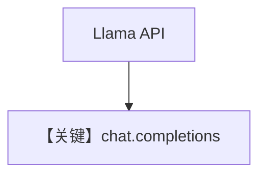

# basic.md — 实现原理分析

> 源文件：`cookbook/90_models/meta/llama/basic.py`

## 概述

**`Llama` 模型** 全四种 `print_response`/`aprint_response` 模式，`markdown=True`。

**核心配置一览：**

| 配置项 | 值 | 说明 |
|--------|-----|------|
| `model` | `Llama(id="Llama-4-Maverick-17B-128E-Instruct-FP8")` | Meta API |
| `markdown` | `True` | Markdown |

## 完整 API 请求

`chat.completions.create`（`llama.py` L227+）。

## Mermaid 流程图

## 关键源码文件索引

| 文件 | 关键 |
|------|------|
| `agno/models/meta/llama.py` | `invoke` L212+ |
