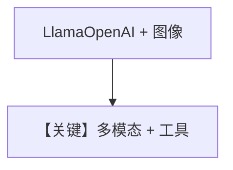

# image_input_bytes.md — 实现原理分析

<!-- cookbook-py-source:start -->
## 完整源码

```python
"""
Meta Image Input Bytes
======================

Cookbook example for `meta/llama/image_input_bytes.py`.
"""

from pathlib import Path

from agno.agent import Agent
from agno.media import Image
from agno.models.meta import LlamaOpenAI
from agno.tools.websearch import WebSearchTools
from agno.utils.media import download_image

# ---------------------------------------------------------------------------
# Create Agent
# ---------------------------------------------------------------------------

agent = Agent(
    model=LlamaOpenAI(id="Llama-4-Maverick-17B-128E-Instruct-FP8"),
    tools=[WebSearchTools()],
    markdown=True,
)

image_path = Path(__file__).parent.joinpath("sample.jpg")

download_image(
    url="https://upload.wikimedia.org/wikipedia/commons/0/0c/GoldenGateBridge-001.jpg",
    output_path=str(image_path),
)

# Read the image file content as bytes
image_bytes = image_path.read_bytes()

agent.print_response(
    "Tell me about this image and give me the latest news about it.",
    images=[
        Image(content=image_bytes),
    ],
    stream=True,
)

# ---------------------------------------------------------------------------
# Run Agent
# ---------------------------------------------------------------------------

if __name__ == "__main__":
    pass
```

<!-- cookbook-py-source:end -->

> 源文件：`cookbook/90_models/meta/llama/image_input_bytes.py`

## 概述

注意：本文件 **`model=LlamaOpenAI`**（非 `Llama`），**+ WebSearchTools + 图像 bytes**，流式。

**核心配置一览：**

| 配置项 | 值 | 说明 |
|--------|-----|------|
| `model` | `LlamaOpenAI(id="Llama-4-Maverick-17B-128E-Instruct-FP8")` | OpenAI 兼容 Meta 路由 |
| `tools` | `[WebSearchTools()]` | 搜索 |
| `markdown` | `True` | Markdown |

用户消息：`Tell me about this image and give me the latest news about it.`

## Mermaid 流程图



## 关键源码文件索引

| 文件 | 关键 |
|------|------|
| `agno/models/meta/llama_openai.py` | `LlamaOpenAI` |
