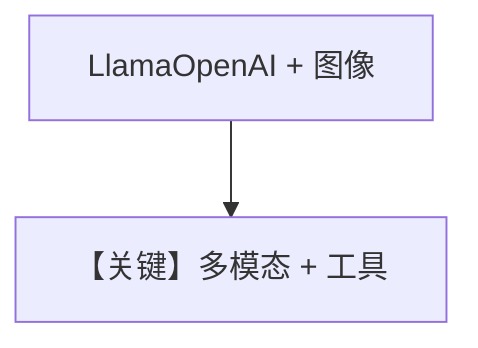

# image_input_bytes.md — 实现原理分析

> 源文件：`cookbook/90_models/meta/llama/image_input_bytes.py`

## 概述

注意：本文件 **`model=LlamaOpenAI`**（非 `Llama`），**+ WebSearchTools + 图像 bytes**，流式。

**核心配置一览：**

| 配置项 | 值 | 说明 |
|--------|-----|------|
| `model` | `LlamaOpenAI(id="Llama-4-Maverick-17B-128E-Instruct-FP8")` | OpenAI 兼容 Meta 路由 |
| `tools` | `[WebSearchTools()]` | 搜索 |
| `markdown` | `True` | Markdown |

用户消息：`Tell me about this image and give me the latest news about it.`

## Mermaid 流程图

## 关键源码文件索引

| 文件 | 关键 |
|------|------|
| `agno/models/meta/llama_openai.py` | `LlamaOpenAI` |
