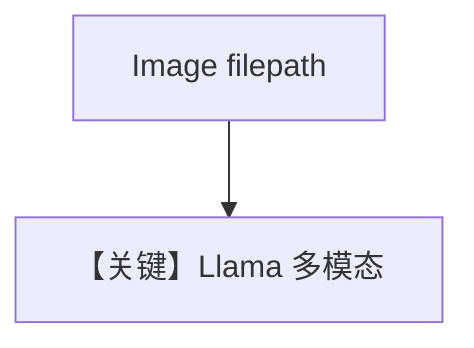

# image_input_file.md — 实现原理分析

<!-- cookbook-py-source:start -->
## 完整源码

```python
"""
Meta Image Input File
=====================

Cookbook example for `meta/llama/image_input_file.py`.
"""

from pathlib import Path

from agno.agent import Agent
from agno.media import Image
from agno.models.meta import Llama
from agno.utils.media import download_image

# ---------------------------------------------------------------------------
# Create Agent
# ---------------------------------------------------------------------------

agent = Agent(
    model=Llama(id="Llama-4-Maverick-17B-128E-Instruct-FP8"),
    markdown=True,
)

image_path = Path(__file__).parent.joinpath("sample.jpg")

download_image(
    url="https://upload.wikimedia.org/wikipedia/commons/0/0c/GoldenGateBridge-001.jpg",
    output_path=str(image_path),
)

agent.print_response(
    "Tell me about this image?",
    images=[Image(filepath=image_path)],
    stream=True,
)

# ---------------------------------------------------------------------------
# Run Agent
# ---------------------------------------------------------------------------

if __name__ == "__main__":
    pass
```

<!-- cookbook-py-source:end -->

> 源文件：`cookbook/90_models/meta/llama/image_input_file.py`

## 概述

**`Llama`（非 OpenAI 变体）+ `Image(filepath=...)`**，本地 JPG，流式。

**核心配置一览：**

| 配置项 | 值 | 说明 |
|--------|-----|------|
| `model` | `Llama(id="Llama-4-Maverick-17B-128E-Instruct-FP8")` | Meta API |
| `markdown` | `True` | Markdown |

用户消息：`Tell me about this image?`

## Mermaid 流程图



## 关键源码文件索引

| 文件 | 关键 |
|------|------|
| `agno/models/meta/llama.py` | `format_message` / 图像 |
