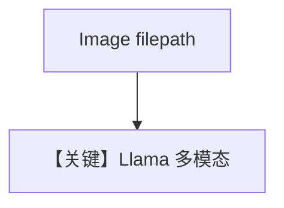

# image_input_file.md — 实现原理分析

> 源文件：`cookbook/90_models/meta/llama/image_input_file.py`

## 概述

**`Llama`（非 OpenAI 变体）+ `Image(filepath=...)`**，本地 JPG，流式。

**核心配置一览：**

| 配置项 | 值 | 说明 |
|--------|-----|------|
| `model` | `Llama(id="Llama-4-Maverick-17B-128E-Instruct-FP8")` | Meta API |
| `markdown` | `True` | Markdown |

用户消息：`Tell me about this image?`

## Mermaid 流程图

## 关键源码文件索引

| 文件 | 关键 |
|------|------|
| `agno/models/meta/llama.py` | `format_message` / 图像 |
