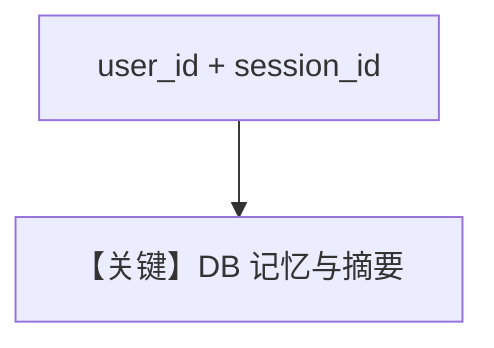

# memory.md — 实现原理分析

> 源文件：`cookbook/90_models/meta/llama/memory.py`

## 概述

**显式 `user_id` / `session_id` + PostgresDb + `update_memory_on_run` + `enable_session_summaries`**，并打印 `get_user_memories` 与会话 `summary`。

**核心配置一览：**

| 配置项 | 值 | 说明 |
|--------|-----|------|
| `model` | `Llama(id="Llama-4-Maverick-17B-128E-Instruct-FP8")` | Meta |
| `user_id` | `"test_user"` | 用户 |
| `session_id` | `"test_session"` | 会话 |
| `db` | `PostgresDb(...)` | 存储 |
| `update_memory_on_run` | `True` | 记忆 |
| `enable_session_summaries` | `True` | 摘要 |

## Mermaid 流程图

## 关键源码文件索引

| 文件 | 关键 |
|------|------|
| `agno/agent/agent.py` | `get_user_memories` |
